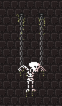

Ghost.js is a tiny HTML5 game engine.

Version 0.3.0 - use at your own peril.

## Core Concepts

This engine provides a collection of classes and functions which simplify some of the heavy-lifting involved in developing simple 2D games from scratch using HTML5.

The following are the core abstractions upon which a game is built on:
- render - provides a number of drawing methods
- surface - wraps a canvas element and provides a renderer
- state - handles game logic and provides a reference to the global surface
- game - handles game states

We may create multiple states and then activate them as needed. The active game state is the one that is currently being updated and drawn and only one state can be active at any given time. States maintain a reference to the global surface object, which wraps the native canvas element and is initialzed on game startup. A surface includes a renderer which is used for drawing graphics. (It is even possible to write custom renderers!)

Most features in this engine are class based and provide an easy to use API which is covered in the documentation. Browse through examples' code to get familiar with API usage.

## License

Copyright (c) 2017 Danijel Durakovic

MIT License
